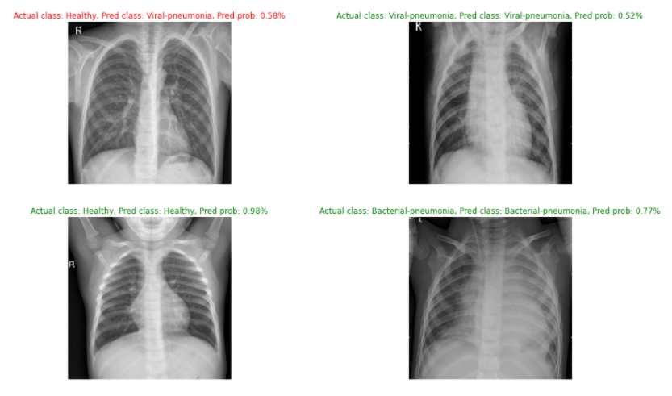
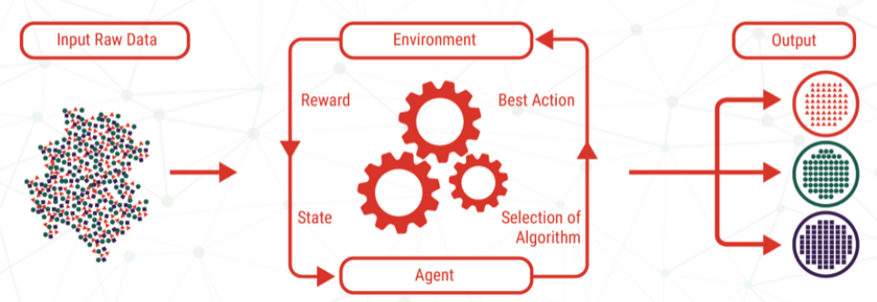

# Chest X-rays for Covid-19 predictions

(Either open and upload on kaggle or local machine)

Dataset corresponds to these three categories
-
       -> Healthy

       -> Bacterial-pneumonia

       -> Viral-pneumonia 

If chest x-rays is Bacterial-pneumonia + Viral-pneumonia, this person is infected with covid-19. Reason for not grouping Bacterial-pneumonia and Viral-pneumonia into one category is because there is different features in the images to look out for in these two categories. Combining them will mess things up as accuracy would be affected, there could be misclassification. Another pointer, is that there is uneven quantity of data in these respective categories. To illustrate, we have 2000+ imgs of Bacterail-pneumonia but only 1400 imgs of healthy lungs. Hence, acc will def be affected.

